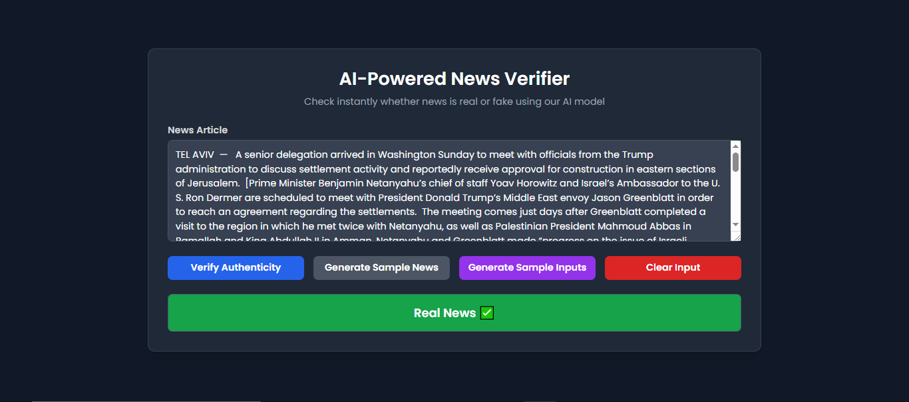

# Fake News Detection

This project is a **web-based tool** designed to help users determine whether a news article is real or fake. 
Using a trained machine learning model, it provides an easy and interactive way to check the authenticity of news content.

---

## **Note:** The CSV dataset is not included in this repository due to its size; a direct source link is provided instead.
- Dataset Source: https://www.kaggle.com/code/simtoor/fake-news-detection/input

---

## Instructions

1. Download the dataset CSV files (`train.csv` and `test.csv`) from the provided source link.  
2. Unzip the downloaded files if needed.  
3. Place `train.csv` and `test.csv` inside the `Data` folder in the project directory.  
4. Run the Flask app using `python app.py` and open it in your browser.


---

## Project Overview

The system uses a **Logistic Regression model** trained on textual features of news articles. By analyzing the text, title, and author, it predicts the authenticity of a news article. Users can **manually input news content** or **generate sample news** to test the model.

---

## Features

- **News Verification**: Quickly check if a news article is real or fake.  
- **Generate Sample News**: Fetches a sample news article from sources and displays it in the news content field.  
- **Generate Sample Inputs**: Retrieves a sample news article from the dataset and instantly fills the author, title, and news content fields without gradual display.  
- **Instant Paste Option**: Quickly populates news content without streaming.  
- **Separate Fields for Author and Title**: Provides distinct input areas for the title and author, making it clear which content belongs where.

---

## Use Cases

- **Journalists & Media Professionals**: Check the reliability of news sources.  
- **Students & Researchers**: Identify unreliable news in research and assignments.  
- **General Users**: Detect fake news circulating on social media or messaging platforms.

---

## Technology Stack

- **Frontend**: HTML, Tailwind CSS, JavaScript  
- **Backend**: Flask  
- **Machine Learning**: Logistic Regression, TF-IDF Vectorizer  
- **Data Handling**: Pandas, Numpy  
- **Text Processing**: NLTK for stemming and stopword removal

---

## How It Works

1. Users input news content manually or generate a sample article.  
2. The text is preprocessed (stopwords removed, stemming applied) for analysis.  
3. The preprocessed content is transformed using the TF-IDF vectorizer.  
4. The Logistic Regression model predicts whether the news is real or fake.  
5. The result is displayed as **Real News ✅** or **Fake News ❌**.

---

## Purpose

This project provides a simple and interactive tool to help users **evaluate news articles**, encouraging critical thinking and careful assessment of online content.

---

## Output
  


---


## 📜 License

This project is open-source and licensed under the [MIT License](LICENSE). See the LICENSE file for full details.

---

## 👤 Author:  **Nayan Darokar** 

## GitHub
```bash
https://github.com/Nayann23
```

## Email:
```bash
reachout.nayan@gmail.com  
```
## Portfolio: 
```bash
https://nayan-datascience-portfolio.vercel.app/
```

